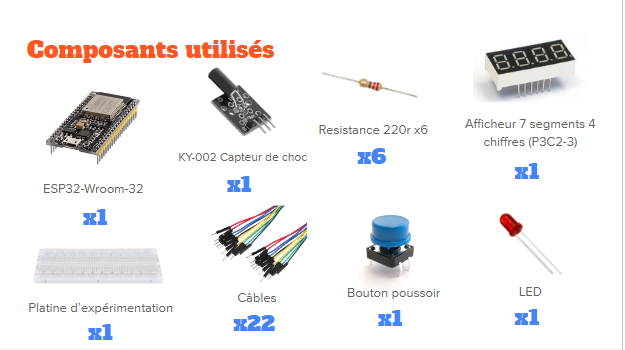

## AbdoSync
<a name="readme-top"></a>

<br />
  <h3 align="center">AbdoSync</h3>

<details>
  <summary>Sommaires</summary>
  <ol>
    <li>
      <a href="#materiaux">Matériaux et références</a>
      <ul>
      <li>
      <a href="#prerequis">Prérequis</a>
      </li>
        <li>
         <a href="#lancer-le-prototype">Lancer le prototype</a>
      </li>
      </ul>
    </li>
    <li>
      <a href="#commencer-une-feature">Commencer une feature</a>
    </li>
    <li>
      <a href="#une-fois-la-feature-terminee">Une fois que la feature est trerminée</a>
    </li>
    <li><a href="#contact">Contact</a></li>
  </ol>
</details>

## Materiaux

1. mircro controlleur x1
url : https://fr.aliexpress.com/item/32806450471.html
ref : ESP-32S ESP-WROOM-32 Development Board 38P NodeMCU
schemas : https://www.upesy.fr/blogs/tutorials/esp32-quickstart-installation-programming-guide

2. capteur 1 (celui utilisé) x1
ref : KY-002 Shock Sensor Module
url : https://sensorkit.joy-it.net/en/sensors/ky-002

3. capteur 2 (testé mais qui ne marche pas pour ce projet) 
ref : KY-031 Hit-Knock Sensor Module
url : https://arduinomodules.info/ky-031-knock-sensor-module/

4. Ecran 4 chiffres x1
ref : P3C2-3
url : https://www.moussasoft.com/produit/afficheur-7-segments-4-chiffres/

5. Bouton poussoir pour circuit imprimé x1
ref : Sans marque/Générique

6. Résistence 220r x6
ref : Sans marque/Générique

7. LED x1
ref : Sans marque/Générique

8. Câbles x22
ref : Sans marque/Générique

9. Platine d'expérimentation x1
ref : Sans marque/Générique



<p align="right">(<a href="#readme-top">revenir en haut</a>)</p>


## Prerequis

1. Assurez-vous d'avoir installé Arduino ide, téléchargez le si besoin :
https://www.arduino.cc/en/software

2. Avoir à disposition une connexion wifi ou un partage de connexion

3. Avoir en sa possession le matériel listé dans <a href="#materiaux">materiaux</a>

<p align="right">(<a href="#readme-top">revenir en haut</a>)</p>


## Lancer le prototype

1. Installez le micro controlleur sur votre prototype

2. Branchez le à votre pc via le cable USB C

3. Installez le pilote 
```sh
https://www.silabs.com/developers/usb-to-uart-bridge-vcp-drivers?tab=downloads
```

3. Lancez arduino IDE, ouvrez file > preferences en haut à gauche, puis dans "Additional boards manager URL's" ajoutez 
```sh
https://dl.espressif.com/dl/package_esp32_index.json
```

Séparez d'une virgule avec les autres urls si besoin.

4. Téléchargez le zip de SevSeg 
```sh
https://www.arduino.cc/reference/en/libraries/sevseg/
```

5. Ensuite installez le zip depuis l'IDE > Sketch > Include Library > Add .zip Library ...

6. Flashez le prototype

7. Monter le prototype correctement depuis <a href="#montage">montage</a>

8. Lancer le projet
git clone https://github.com/domov44/tp-iot

9. Ouvrer le index.ino dans arduino ide

10. installez les librairies suivants depuis l'ide : 
-WiFi : Bibliothèque pour la gestion de la connectivité Wi-Fi.
By Arduino.

-WebServer : Bibliothèque pour la création d'un serveur web sur Arduino.
By Arduino.

-WebSocketsServer : Bibliothèque pour la mise en place de serveurs WebSocket sur Arduino.
By Markus Sattler.

-SevSeg : Bibliothèque pour la gestion d'afficheurs à sept segments (LED, LCD, etc.).
By Dean Reading.

11. Lancer un partage de connexion avec son téléphone (doit être android), connecter son ordinateur qui execute le code sur cette wifi.

12. Remplacer les valeurs de const de connexions dans index.ino par vos valeurs wifi (nom, et mot de passe) ligne 6 et 7.

13. Remplacer les valeurs de const de connexions dans index.ino par vos valeurs wifi (nom, et mot de passe) ligne 6 et 7.


### Commencer une feature

Important : personne ne doit push sur main,
Une feature = une branche

6. Créer votre branch Github de feature
```sh
git checkout -b "feature/ma-branche-temporaire"
```

7. S'assurer d'être sur la bonne branch
```sh
git status
```

<p align="right">(<a href="#readme-top">revenir en haut</a>)</p>


## Une fois la feature terminee

Une fois que vous avez terminé la feature et que tout marche sur votre local suivez ces étapes :

1. Commitez vos changes 
```sh
git add .
git commit -m "[ADD] précision"
git push origin feature/ma-branche-temporaire
```
2. Sur Gitub lancez une Pull request sur la branch Develop et attendez que Ronan ou Killian valide le merge

<p align="right">(<a href="#readme-top">retour en haut</a>)</p>

## Contact

Si vous avez une question contactez-nous sans hésiter sur **ronanscotet467@gmail.com** ou **killian-habasque@gmail.com**

<p align="right">(<a href="#readme-top">revenir en haut</a>)</p>
